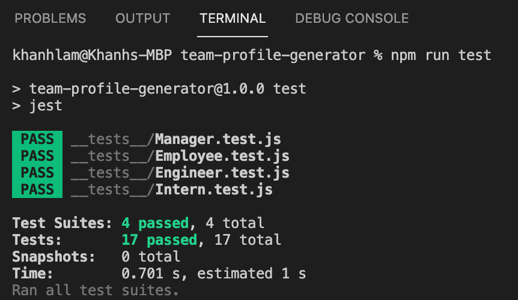
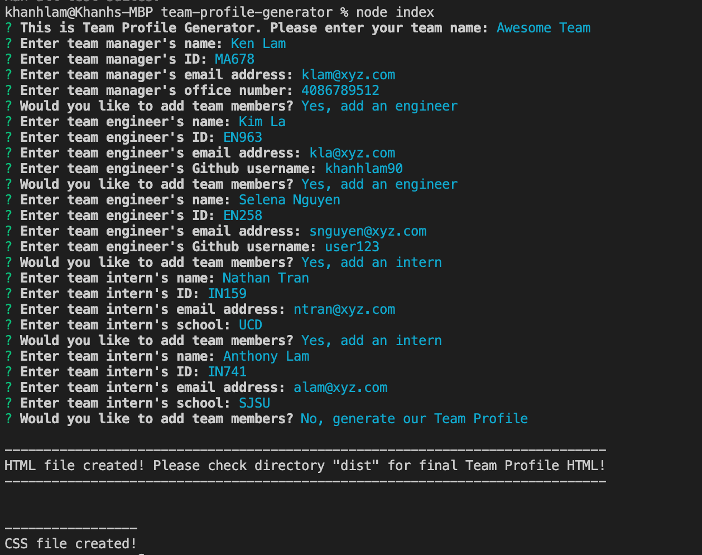
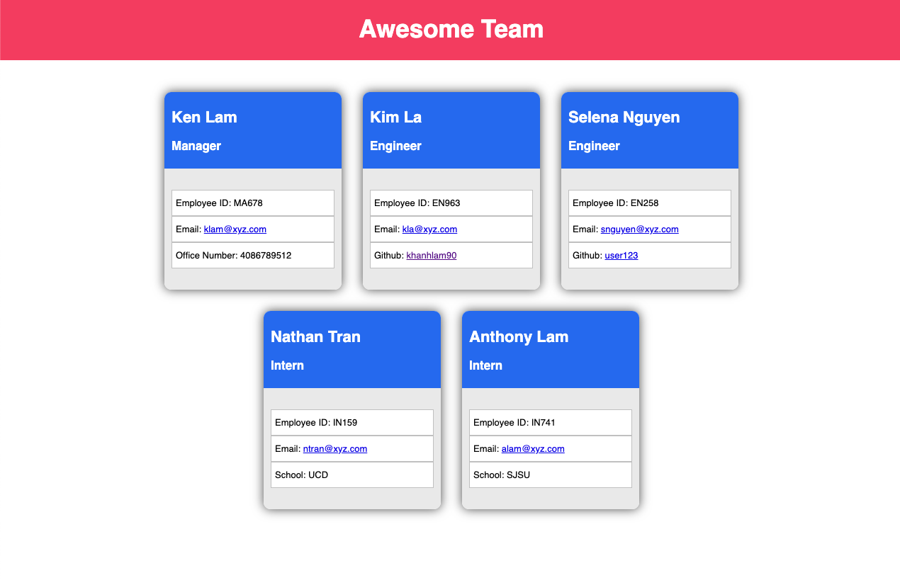
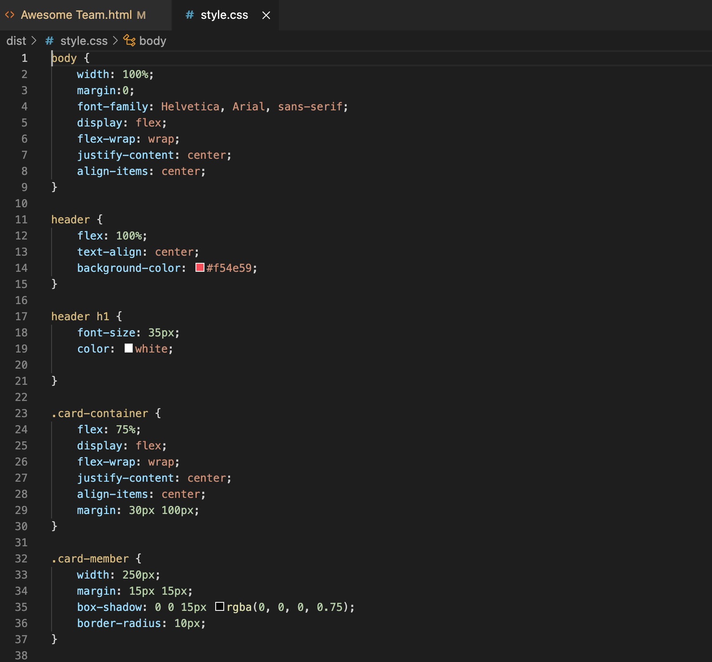

# Team Profile Generator

## Description
This application takes in information about employees on a software engineering team and generates an HTML webpage that displays summaries for each person. 

Because testing is key to making code maintainable, unit tests for each part of the code were written and ensured that it passes all of them.

This project creates a command-line application that dynamically generates a professional README.md file from a user's input using the [Inquirer package](https://www.npmjs.com/package/inquirer).

## User Story and Criteria
AS A manager
I WANT to generate a webpage that displays my team's basic info
SO THAT I have quick access to their emails and GitHub profiles

GIVEN a command-line application that accepts user input
WHEN I am prompted for my team members and their information
THEN an HTML file is generated that displays a nicely formatted team roster based on user input
WHEN I click on an email address in the HTML
THEN my default email program opens and populates the TO field of the email with the address
WHEN I click on the GitHub username
THEN that GitHub profile opens in a new tab
WHEN I start the application
THEN I am prompted to enter the team manager’s name, employee ID, email address, and office number
WHEN I enter the team manager’s name, employee ID, email address, and office number
THEN I am presented with a menu with the option to add an engineer or an intern or to finish building my team
WHEN I select the engineer option
THEN I am prompted to enter the engineer’s name, ID, email, and GitHub username, and I am taken back to the menu
WHEN I select the intern option
THEN I am prompted to enter the intern’s name, ID, email, and school, and I am taken back to the menu
WHEN I decide to finish building my team
THEN I exit the application, and the HTML is generated

## Table of Contents

* [Installation](#installation)
* [Usage](#usage)
* [License](#license)
* [Contributing](#contributing)
* [Tests](#tests)
* [Questions](#questions)
* [Links](#links)

## Installation

To use this application, please follow the following steps:
- Clone the repository using SSH - 'git clone git@github.com:khanhlam90/team-profile-generator.git'
- Run npm to install the inquirer dependencies - 'npm install inquirer'
- Run npm to install the jest dependencies - 'npm install jest --save-dev'
- Open the package.json file. Note that the scripts property already has a "test" property. Change that value to jest.

## Usage 
After the installation, please follow:
- Run 'node index.js' or simply 'node index'
- Answer prompts question as detailed as possible to generate a concise and profssional yourteamprofilename.html
- At the end of the prompts, a successful message will appear
- Navigate to root directory and access into sub-directory named 'dist' - your yourteamprofilename.html file is placed in there, along with a generated style.css file.
- Keep in mind that users always have to preview the just-created version of the file for correction, such as spellings, grammars, details, etc.
- Unit tests for each part of the code:

- Screenshot of Command Line Demonstration:

- Screenshot of HTML output - viewed in VS Code:

- Screenshot of HTML output - viewed in Chrome :

- Screenshot of CSS output - viewed in VS Code :

- [Link to the video demonstration of how to run the application](https://drive.google.com/drive/folders/1B6jNESKHkZAgko8mgUu6xQ1EsnDlw_S2?usp=sharing)

## License

This project is using the MIT License.

## Contributing

Please feel free to contribute to this project - please find my info at the [Questions](#questions) section and contact me for more infomation.

## Tests

Please refer to [Usage](#usage) section.

## Questions

Please reach me using:

<a href = "mailto:khanhlam1990@yahoo.com"> My Email </a>

[My Github Account](https://github.com/khanhlam90)

## Project Links:
* [Demostration Video](https://drive.google.com/drive/folders/1B6jNESKHkZAgko8mgUu6xQ1EsnDlw_S2?usp=sharing)
* [Sample HTML and CSS](./dist)
* [Github Repository](https://github.com/khanhlam90/team-profile-generator.git)

